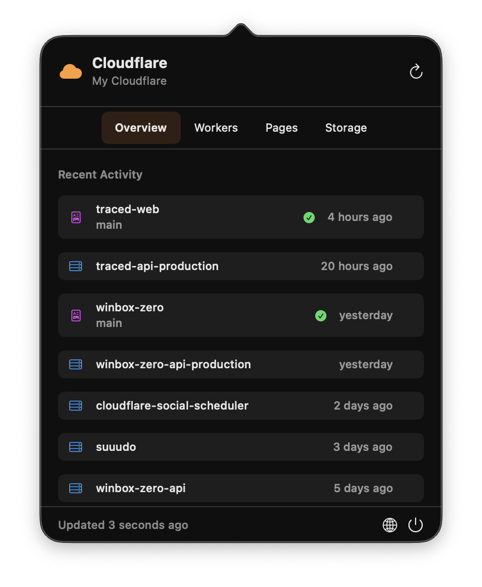

# CloudflareStatusBar

A native macOS menu bar app for monitoring your Cloudflare resources.

<p align="center">
  
</p>

## Installation

### Homebrew (Recommended)

```bash
brew tap sushaantu/cloudflare-status-bar
brew install --cask cloudflare-status-bar
```

### Manual Download

Download the latest release from the [Releases page](https://github.com/sushaantu/CloudflareStatusBar/releases/latest).

## Prerequisites

The app uses your existing [Wrangler CLI](https://developers.cloudflare.com/workers/wrangler/) credentials. If you haven't already:

```bash
npm install -g wrangler
wrangler login
```

## Features

- **Workers** - View all deployed Workers with usage model and compatibility info
- **Pages** - Monitor Pages projects with deployment status and history
- **KV Namespaces** - List all KV namespaces
- **R2 Buckets** - View R2 storage buckets with location info
- **D1 Databases** - Monitor databases with table counts and size
- **Queues** - Track message queues with producer/consumer counts
- **Auto-refresh** every 5 minutes
- **Deployment notifications** for success/failure
- **Quick links** to Cloudflare Dashboard

## Usage

1. Click the cloud icon in your menu bar to open the popup
2. Switch between Overview, Workers, Pages, and Storage tabs
3. Click refresh or wait for auto-refresh (every 5 minutes)
4. Click items to open them in Cloudflare Dashboard

## Updating

```bash
brew upgrade --cask cloudflare-status-bar
```

## Requirements

- macOS 13.0 (Ventura) or later
- Wrangler CLI authenticated (`wrangler login`)

## Troubleshooting

### "Not Authenticated" message

Run `wrangler login` in your terminal and restart the app.

### API errors

Ensure your Cloudflare account has access to the resources you're trying to view. Some features (R2, D1, Queues) may require specific account permissions.

## Building from Source

```bash
git clone https://github.com/sushaantu/CloudflareStatusBar.git
cd CloudflareStatusBar
open CloudflareStatusBar.xcodeproj
```

Build and run with Xcode (Cmd + R).

## Credential Locations

The app looks for Wrangler credentials in these locations (in order):

1. `~/Library/Preferences/.wrangler/config/default.toml`
2. `~/.wrangler/config/default.toml`
3. `~/.config/.wrangler/config/default.toml`
4. `~/.config/wrangler/config/default.toml`
5. Environment variable: `CLOUDFLARE_API_TOKEN`

## Disclaimer

This project is not affiliated with, endorsed by, or sponsored by Cloudflare, Inc. "Cloudflare" is a registered trademark of Cloudflare, Inc.

## License

MIT
