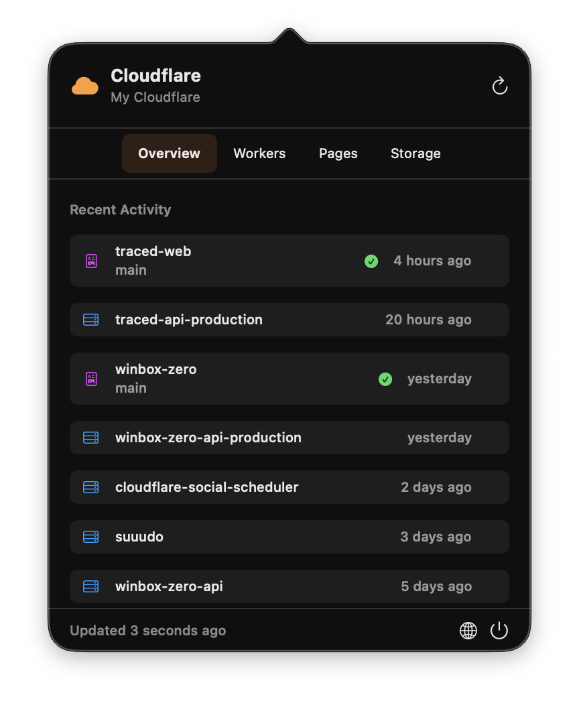

# CloudflareStatusBar

A native macOS menu bar app for monitoring your Cloudflare resources.

<p align="center">
  
</p>

## Installation

### Homebrew (Recommended)

```bash
brew tap sushaantu/cloudflare-status-bar
brew install --cask cloudflare-status-bar
```

### Manual Download

Download the latest release from the [Releases page](https://github.com/sushaantu/CloudflareStatusBar/releases/latest).

## Authentication

The app supports two authentication methods:

### Option 1: Wrangler Login (Simple)

Use your existing [Wrangler CLI](https://developers.cloudflare.com/workers/wrangler/) credentials:

```bash
npm install -g wrangler
wrangler login
```

### Option 2: API Token Profiles (Multiple Accounts)

If you manage multiple Cloudflare accounts, you can create profiles with API tokens:

1. Click the 👥 icon in the app footer
2. Click "Add Profile"
3. Enter a name (e.g., "Personal", "Work") and your API token
4. Click to switch between profiles

Get your API token from: [Cloudflare Dashboard → My Profile → API Tokens](https://dash.cloudflare.com/profile/api-tokens)

## Features

- **Workers** - View all deployed Workers with usage model and compatibility info
- **Pages** - Monitor Pages projects with deployment status and history
- **KV Namespaces** - List all KV namespaces
- **R2 Buckets** - View R2 storage buckets with location info
- **D1 Databases** - Monitor databases with table counts and size
- **Queues** - Track message queues with producer/consumer counts
- **Multiple Profiles** - Manage multiple Cloudflare accounts with different API tokens
- **Account Switching** - Switch between accounts within the same profile
- **Auto-refresh** every 5 minutes
- **Deployment notifications** for success/failure
- **Quick links** to Cloudflare Dashboard

## Usage

1. Click the cloud icon in your menu bar to open the popup
2. Switch between Overview, Workers, Pages, and Storage tabs
3. Click refresh or wait for auto-refresh (every 5 minutes)
4. Click items to open them in Cloudflare Dashboard

## Updating

```bash
brew upgrade --cask cloudflare-status-bar
```

## Release Signing and Notarization

Homebrew cask installs are quarantined by macOS, so release zip assets must contain a Developer ID signed and notarized app. Ad-hoc signed builds will verify with `codesign`, but Gatekeeper will reject them after download.

### Local release build

```bash
export TEAM_ID="3LD9A48W2C"
export NOTARY_KEYCHAIN_PROFILE="cloudflare-status-bar"
scripts/build_release.sh
```

Alternatively, set `APPLE_ID` and `APP_SPECIFIC_PASSWORD` instead of `NOTARY_KEYCHAIN_PROFILE`. The script writes `dist/CloudflareStatusBar-<version>.zip`, staples the notarization ticket, runs Gatekeeper assessment, and prints the sha256 for the Homebrew cask.

For App Store Connect API key notarization, set `ASC_KEY_PATH` and `ASC_KEY_ID`; set `ASC_ISSUER_ID` too when using a team key.

### GitHub Actions release build

The `Release signed macOS app` workflow runs for `v*` tags and can also be run manually for an existing tag. Configure these repository secrets before using it:

- `BUILD_CERTIFICATE_BASE64` - Base64-encoded Developer ID Application `.p12`
- `P12_PASSWORD` - Password for the exported `.p12`
- `KEYCHAIN_PASSWORD` - Temporary CI keychain password
- `APPLE_TEAM_ID` - Apple Developer Team ID, for example `3LD9A48W2C`
- `APPLE_ID` - Apple ID used for notarization, when using app-specific password auth
- `APP_SPECIFIC_PASSWORD` - App-specific password for notarization
- `APP_STORE_CONNECT_API_KEY_BASE64` - Base64-encoded App Store Connect `.p8`, when using API key auth instead of app-specific password auth
- `APP_STORE_CONNECT_KEY_ID` - App Store Connect API key id
- `APP_STORE_CONNECT_ISSUER_ID` - App Store Connect issuer id, required for team keys
- `SIGNING_IDENTITY` - Optional; defaults to `Developer ID Application`
- `HOMEBREW_TAP_TOKEN` - Optional token with push access to `sushaantu/homebrew-cloudflare-status-bar`

To repair a bad existing release asset, run the workflow manually for that tag, for example `v1.6.1`, with cask updating enabled. If the cask token is not configured, update `Casks/cloudflare-status-bar.rb` in the tap with the sha256 printed by the workflow. For normal releases, tag a new version and let the workflow upload the notarized zip and update the cask.

## Requirements

- macOS 13.0 (Ventura) or later
- Either `wrangler login` credentials OR an API token profile

## Troubleshooting

### "Not Authenticated" message

Either:
- Run `wrangler login` in your terminal and restart the app, OR
- Click "Add Profile" and add an API token

### Using API Token with `wrangler login`

If you have `CLOUDFLARE_API_TOKEN` set in your environment (e.g., in `.envrc`, `.bashrc`, or `.zshrc`) and get an error when running `wrangler login`:

```
✘ [ERROR] You are logged in with an API Token. Unset the CLOUDFLARE_API_TOKEN in the environment to log in via OAuth.
```

Temporarily unset it to authenticate:

```bash
unset CLOUDFLARE_API_TOKEN && wrangler login
```

This creates an OAuth token that the app can use. Your API token will still work for CLI usage when the environment variable is set.

### Environment variables not working

macOS GUI apps (like this menu bar app) cannot read shell environment variables set in `.bashrc`, `.zshrc`, or `.envrc`. The app reads credentials from:

1. Wrangler config files (created by `wrangler login`) - **Recommended**
2. System-level environment variables set via `launchctl setenv`

For most users, `wrangler login` is the simplest solution.

### API errors

Ensure your Cloudflare account has access to the resources you're trying to view. Some features (R2, D1, Queues) may require specific account permissions.

### Decoding errors / Proxy issues

If you see "Unexpected response format" errors, a proxy or firewall may be intercepting requests. The error message will show a preview of what was received. Check your network configuration or try from a different network.

## Building from Source

```bash
git clone https://github.com/sushaantu/CloudflareStatusBar.git
cd CloudflareStatusBar
open CloudflareStatusBar.xcodeproj
```

Build and run with Xcode (Cmd + R).

## Credential Locations

The app checks credentials in this order:

1. **Active Profile** (if set) - API tokens stored securely in macOS Keychain
2. **Wrangler config files** (if no profile active):
   - `~/Library/Preferences/.wrangler/config/default.toml`
   - `~/.wrangler/config/default.toml`
   - `~/.config/.wrangler/config/default.toml`
   - `~/.config/wrangler/config/default.toml`

## Footer Icons

| Icon | Action |
|------|--------|
| 👥 | Manage Profiles |
| 🔄 | Check for Updates |
| 🔗 | View on GitHub |
| 🌐 | Open Cloudflare Dashboard |
| ⏻ | Quit |

## Disclaimer

This project is not affiliated with, endorsed by, or sponsored by Cloudflare, Inc. "Cloudflare" is a registered trademark of Cloudflare, Inc.

## License

MIT
